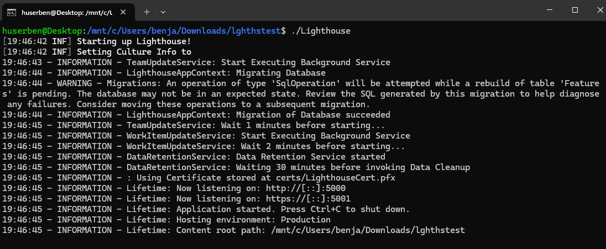
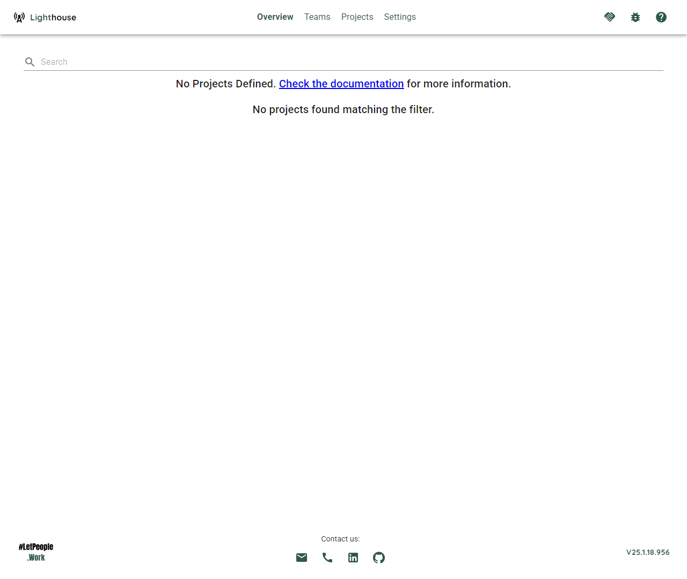

If you can't or don't want to use [Docker](./docker.html), you can also run Lighthouse on your system directly.

- TOC
{:toc}

## Prerequisites
The packages provided by Lighthouse have everything included you need to run it, so there are no prerequisites.

Lighthouse runs on Windows, MacOs, and Linux based systems.

## Download Lighthouse
Download the latest version of Lighthouse for your operating system from the [Releases](https://github.com/LetPeopleWork/Lighthouse/releases/latest).
Download the zip file, and extract it to the location you want to run the application from.

## Updating Lighthouse
If you want to update Lighthouse, you can simply replace the files in the directory.

{: .note }
As the published packages do not include the database, you will keep your data. Lighthouse will in normal circumstances always support migrations to newer versions, so you will not lose any data.

{: .note }
You must make sure to stop Lighthouse from running before updating.

## Installation and Update Scripts
If you don't want to manually download it, you can also use the following scripts, which will look for the latest released version and will download and extract it from the directory you run the script from.

The scripts are part of the packages, so you can execute them from the installation directory.

### Windows
You can run the Powershell script [update_windows.ps1](https://github.com/LetPeopleWork/Lighthouse/blob/main/Scripts/update_windows.ps1). In order to do so, you need to have PowerShell 5.1 or later which is normally installed at your system.

You can also directly download the latest version into your current directory by executing the following command in your terminal:

```powershell
iwr 'https://raw.githubusercontent.com/LetPeopleWork/Lighthouse/main/Scripts/update_windows.ps1' | iex
```
  
### Linux
For Linux, there is a bash script called [update_linux.sh](https://github.com/LetPeopleWork/Lighthouse/blob/main/Scripts/update_linux.sh). It requires unzip to be installed, which you can do by running the following command:

`sudo apt-get install unzip`

You can also directly download the latest version into your current directory by executing the following command in your terminal:

```bash
curl -sSL https://raw.githubusercontent.com/LetPeopleWork/Lighthouse/main/Scripts/update_linux.sh | bash
```

### MacOS
For MacOS, there is a bash script called [update_mac.sh](https://github.com/LetPeopleWork/Lighthouse/blob/main/Scripts/update_mac.sh). It requires unzip to be installed, which is usually pre-installed on MacOS.

You can also directly download the latest version into your current directory by executing the following command in your terminal:

```bash
curl -sSL https://raw.githubusercontent.com/LetPeopleWork/Lighthouse/main/Scripts/update_mac.sh | bash
```

## Run Lighthouse
Once downloaded, you can run the the `Lighthouse` application:
- `Lighthouse.exe` on Windows
- `Lighthouse` on MacOS and Linux

A terminal will open and you should see a window similar to this:



By default, Lighthouse will start running on the system on port 5001. If everything worked as expected, you can open the app now in your browser via [https://localhost:5001](https://localhost:5001).

You should see the (empty) landing page:


## Run as Service
Using this approach, you'll have to restart Lighthouse after every restart. What you can do instead is to register it as a service, that way it will run automatically in the background.

### Windows
To run `Lighthouse.exe` as a Windows service, you can use the `New-Service` cmdlet in PowerShell. Follow these steps:

1. Open PowerShell as an Administrator.
2. Execute the following command to create a new service:

```powershell
New-Service -Name "LighthouseService" -BinaryPathName "C:\path\to\Lighthouse.exe" -DisplayName "Lighthouse Service" -Description "Service to run Lighthouse application" -StartupType Automatic
```

Replace `C:\path\to\Lighthouse.exe` with the actual path to your `Lighthouse.exe` file.

3. Start the service with the following command:

```powershell
Start-Service -Name "LighthouseService"
```

4. To ensure the service starts automatically after a reboot, you can check its status with:

```powershell
Get-Service -Name "LighthouseService"
```

This will run `Lighthouse.exe` as a Windows service, ensuring it starts automatically and runs in the background.

{: .note }
Make sure to stop the Lighthouse service before updating to avoid any conflicts.

### Linux
To run `Lighthouse` as a service on Linux using `systemd`, follow these steps:

1. Create a new service file for Lighthouse. Open a terminal and run:

```bash
sudo nano /etc/systemd/system/lighthouse.service
```

2. Add the following content to the file:

```ini
[Unit]
Description=Lighthouse Service
After=network.target

[Service]
ExecStart=/path/to/Lighthouse
Restart=always
User=nobody
Group=nogroup

[Install]
WantedBy=multi-user.target
```

Replace `/path/to/Lighthouse` with the actual path to your `Lighthouse` executable.

3. Save and close the file.

4. Reload the systemd manager configuration to apply the changes:

```bash
sudo systemctl daemon-reload
```

5. Enable the Lighthouse service to start on boot:

```bash
sudo systemctl enable lighthouse.service
```

6. Start the Lighthouse service:

```bash
sudo systemctl start lighthouse.service
```

7. Check the status of the service to ensure it is running correctly:

```bash
sudo systemctl status lighthouse.service
```

This will run `Lighthouse` as a service on Linux, ensuring it starts automatically and runs in the background.


{: .note }
Make sure to stop the Lighthouse service before updating to avoid any conflicts.

```bash
sudo systemctl stop lighthouse.service
```

#### Uninstall
To remove the Lighthouse service, execute these commands:

```bash
sudo systemctl stop lighthouse.service
sudo systemctl disable lighthouse.service
sudo rm /etc/systemd/system/lighthouse.service
sudo systemctl daemon-reload
```

### MacOS
To run `Lighthouse` as a service on MacOS using `launchd`, follow these steps:

1. Create a new plist file for Lighthouse. Open a terminal and run:

```bash
sudo nano /Library/LaunchDaemons/com.lighthouse.plist
```

2. Add the following content to the file:

```xml
<?xml version="1.0" encoding="UTF-8"?>
<!DOCTYPE plist PUBLIC "-//Apple//DTD PLIST 1.0//EN" "http://www.apple.com/DTDs/PropertyList-1.0.dtd">
<plist version="1.0">
<dict>
   <key>Label</key>
   <string>com.lighthouse</string>
   <key>ProgramArguments</key>
   <array>
      <string>/path/to/Lighthouse</string>
   </array>
   <key>RunAtLoad</key>
   <true/>
   <key>KeepAlive</key>
   <true/>
   <key>StandardOutPath</key>
   <string>/var/log/lighthouse.log</string>
   <key>StandardErrorPath</key>
   <string>/var/log/lighthouse.err</string>
</dict>
</plist>
```

Replace `/path/to/Lighthouse` with the actual path to your `Lighthouse` executable.

3. Save and close the file.

4. Load the new service:

```bash
sudo launchctl load /Library/LaunchDaemons/com.lighthouse.plist
```

5. Start the Lighthouse service:

```bash
sudo launchctl start com.lighthouse
```

6. Check the status of the service to ensure it is running correctly:

```bash
sudo launchctl list | grep com.lighthouse
```

This will run `Lighthouse` as a service on MacOS, ensuring it starts automatically and runs in the background.

{: .note }
Make sure to stop the Lighthouse service before updating to avoid any conflicts.
