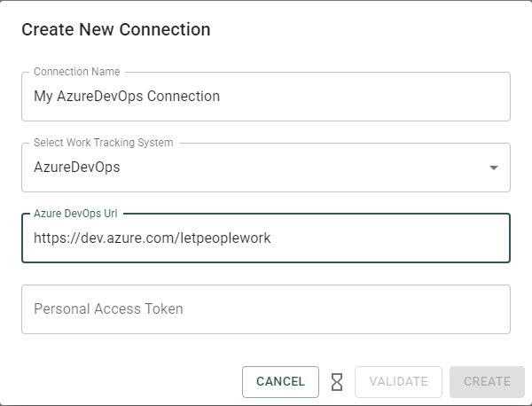

This section will give you a brief overview over how to set up Lighthouse with connections to your work tracking system, add teams and create projects.

Lighthouse currently works with [Jira](./jira.html) and [Azure DevOps](./azuredevops.html). Check out the dedicated subpages for details on how to configure it Lighthouse for the respective systems.

- TOC
{:toc}

Once you're done with the basics, check out the detailed description of the [Features](../features/features.html).

# Overview
Lighthouse has a few basic components that you need to be aware of:
- Work Tracking Systems that define how to connect to your systems
- Queries are how you can filter data for Teams and Projects
- Team are entities that have a Throughput and work on a dedicated backlog
- Projects are having Features where one or more teams work on

The following chart shows those building blocks and how they interact.

```mermaid
%%{init: {'theme': 'neutral'}}%%
flowchart TD
    A(Team) -->|has| G[Throughput]
    A -->|uses| B(Work Tracking System)
    C(Project) -->|uses| B
    C -->|contains| H[Features]
    A -->|contributes to| C
    B -->|uses| F[Query]
    F -->|connects to| D(Jira)
    F -->|connects to| E(Azure DevOps)
    F -->|connects to| I(...)
```

# Work Tracking System
The Work Tracking System is the place where your backlog lives. Lighthouse is designed to onboard more systems as needed (please [create a request](https://github.com/LetPeopleWork/Lighthouse/issues/new?assignees=&labels=enhancement&projects=&template=feature-request.yml&title=%5BFeature%5D%3A+) If you'd like to see a new system supported).

Currently supported are [Jira](./jira.html) and [Azure DevOps](./azuredevops.html). The general workflow is the same for any Work Tracking System, the difference is in the information required to connect to the system and how to write the [queries](#query).

## Creating a Work Tracking System Connection
You can create a new connection to your work tracking system either during the creation of your teams and projects, or via the Settings tab.

Once defined, you can reference them via name when you set up your teams and project. What information is needed for the connection depends on the specific Work Tracking System, please check in the subpages for your system to get more detailed information.

# Query
Lighthouse is using the built-in query languages from the work tracking systems to fetch the data needed for the forecasts. This makes the tool flexible and allows you to define teams and projects in whatever way makes sense to you.

For specifics on the query language as well as some examples and support, check the specific subpages for your system.

# Teams
Before we can forecast anything, we need to have at least one team configured.

{: .definition}
> A team is defined by the fact that it is getting items to done. Or in other words, each team has a [Throughput](https://kanbanguides.org/english/#elementor-toc__heading-anchor-10).    

Lighthouse needs the Throughput to create forecasts. How to get this Throughput depends on the [Query](#query). It's up to you how you want to define this in Lighthouse.

It often make sense to use the same team definition that you have in your environment. However, there might be situation when you want to define it differently, for example 'merging' the Throughput of two teams and model it as a single team in Lighthouse.

Most often also the team level items are something like *User Stories* and *Bugs*. However again, you can define what types should be included in this defintion. You may change this to other types. If you are looking to forecast completion dates of Epics, you may want to check out the use of [Projects](#projects).

{: .note}
> You need at least one team, and then you can start making use of Lighthouse. Check [Features](../features/features.html) for a description of all features of Lighthouse.

# Projects

{: .definition}
> A Project as a collection of *Features*. A feature is a higher-level item that contains child-items. The child-items are the items that the [Teams](#teams) are working on. Each project must have at least one involved team. Many teams can contribute to a single project, and each team can be involved in many projects.

Projects allow to scale your forecasts beyond the team level. When you need to answer when your collection of *Features* will be done, defining a project is the way to go.

Refer to [Features](../features/features.html) to get more details on how to fine-tune and configure Projects.

# Forecast
All of the above is done so that in the end we can run forecasts. Lighthouse is using *Monte Carlo Simulations* to run *How Many* (can be done for a specific team) as well as *When* forecasts. See [Monte Carlo Simulations](./montecarlosimulations.html) for more details.